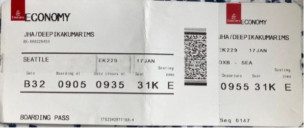
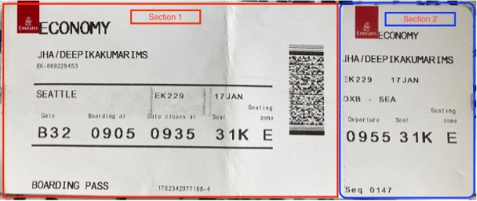
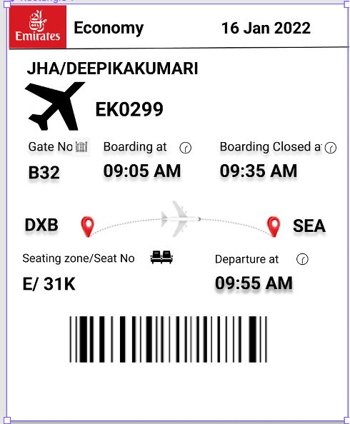
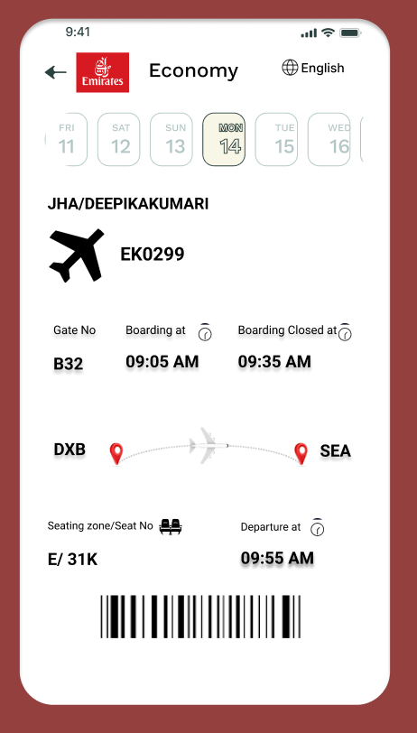

# Case Study : Emirates Boarding Pass Analysis 
Do you have travel anxiety? How many times you check if you kept your boarding pass safely before getting into plane? Are you quickly able to process the information provided in boarding pass? Though I always faced these issues while travelling I never really analyzed why information is arranged in certain way in all the boarding passes. Now that I am learning about user experience, I can implement my learning in designing user friendly boarding passes.

## Emirates current boarding pass

To begin with let’s look at design of current boarding pass of Emirates Airline.

### Issues with Emirates current boarding pass design

1. **Boarding pass dimensions**: I always struggle to keep boarding pass safe. It goes nowhere neither in my wallet nor in my passport.
2. **Signifiers**: All the information provided in the boarding pass is in the form of text which is more difficult to process compared to icon and image. It becomes even more difficult when you don’t know the language your boarding pass printed in.
3. **Language**: There is no choice of language while printing boarding passes. International airlines boarding passes are generally in English. What if person don’t know English? Is there any choice for them?
4. **Hierarchy**: Information should be provided based on priority and location they going to be used.
5. **Formatting**: Formatting of few information like time should be changed to reflect time appropriately. For example, in pass boarding “0905” signifies time I think it can be modified to the 09:05 AM for better understanding.
Now that I know issues with the boarding pass design. I can give attempt to re design the boarding pass to make it more user friendly.

## Defining Scope
Before redesigning the boarding pass its always better to define the scope of the project to produce feasible outcome. Below are the constraints I followed for myself
 
1. **Information**: Include all the information present in the current boarding pass because different information is processed by stakeholders differently.
2. **Use of limited colors**: Check In/Kiosk counters at airports are responsible for printing thousands of boarding passes in a day. Adding more colors to the design can add cost significantly so it is advised to use limited color combination for the boarding pass.

## Information Architecture
Information architecture is a discipline that focuses on the organization of information within the product.

Currently Emirates boarding has two sections which are used by different stakeholders
1. Section 1 is used by passengers
2. Section 2 is used by staff members

My work is primarily focused on re-designing section 1 as it is used by passengers and also I have little knowledge about the section2.

## Information Architecture of new boarding pass

To define the information architecture of the new boarding pass lets first define the criteria for arranging the information.
1. **On the basis of stakeholders using the information**
   * Passenger
   * Staff
2. **On the basis of time at which information is used**
   * Pre-boarding 
   * Post-boarding
 
So, based on above criteria’s, information architecture should be

#### For Passengers
   * **At Pre boarding time**: Passenger Name, Flight No, Date, Gate No, Boarding time, Source, Destination.
   * **At Post boarding time**: Seating Zone, Seat No, Departure time
#### For Staff
   * Class (Economy/Business/ First class)
   * Seating Zone
  
### Analogy behind the chosen Information Architecture

#### Preboarding:

It is duration when you take your boarding passes and reaches to the gate for boarding flight.
1. Multiple passengers might be travelling together so name of the passenger on the ticket is very important to identify the person whom ticket belongs.
2. During preboarding, passenger should know the flight number and gate number so that passenger can go to respective gate number. This is valid even in case when passenger is doing other activity like having food or going restrooms. Having flight number handy also helps in checking status at information displays at airports in case last minute change in Gate number. So Flight no, Gate number and Boarding time is top priority for the passengers.
3. Date, Source and Destination is something an anxious person like me might need till the time person isn’t on the flight, other than that its mostly used by the airport staff to make sure person is boarding the right flight. So, this can have low priority.

#### Post-boarding: 
This is the time after boarding the flight. In this period the passenger can be indulged in below activities:
1. The main activity is to reach their designated seat. The seat number is therefore vital.
2. The other thing one might do is check the exact time the flight is supposed to take off. Therefore, departure time is included here.

### Design For Home/Kiosk Print

#### Explanation for Design
1. **Boarding pass dimension for Home/Kiosk print**: As many of us are anxious about keeping boarding pass safe I had two options for selecting the dimensions of boarding pass equivalent to
   * Wallet, or,
   * Passport size 32-page booklet (15.5 cm x 10.5 cm (6.1 inches x 4.1inches)

   I rejected the idea of wallet as many people have different wallet size. I choose to make boarding pass dimensions equivalent to the passport because Emirates is an international flight and people travelling abroad always carry passport, so it is better to make boarding pass fit in passport. I have highlighted the part that can be folded to fit both section 1 and section 2 fit in passport.

2. **Introduced Icons**: As discussed above the present design needed some signifiers. I knew I had to use them scarcely as well because every new signifier would add to the learning curve. I decided to use them to signify departure and arrivals so that it's easier to navigate that information. I used icons for displaying things like flights, source, destination etc. These signifiers are more perceptible compared to texts. People who don’t know language used for printing boarding pass can easily identify what they are looking for.

3. **Hierarchy of Information**: I have arranged the information in boarding pass for Home/Kiosk/Mobile in the format as explained in Information Architecture before this topic. Arranging information in this manner help to quickly find the information in boarding pass.

4. **Formatting**: Updated formatting of time mentioned in boarding pass to avoid confusion. For example, I have changed the format used before for timing “0905” to “09:05 AM” to correctly display the information.

### Design for Mobile App

#### Explaining Emirates boarding pass for mobile app
   1. **Dimension**: For choosing dimensions of boarding pass for mobile app we need to make sure of the layouts which fits with all the devices in Android as well as iPhone. We can take care of these thing by defining Auto Layouts while developing application.
   2. **Use of more icons**: Since boarding pass for mobile application is not used for printing, I took liberty for adding more icons to make it attractive without compromising the information architecture. I still wanted to keep it simple to process the information.
   3. **Language Feature**: I added language feature to the top right corner so that user can choose the language of their choice making it feasible for people who don’t know English.
   4. **Hierarchy of Information**: I followed the same information architecture as I followed for home/kiosk print which is explained above under “Information Architecture” topic.
 
### User Benefits
1. Simple boarding pass design and thoughtful arrangement of information will help user to process information quickly.
2. Uses of icons and images makes information more perceptible for passengers.
3. Having boarding pass available in mobile phone help passenger to escape from chaos situation at airports. Also standing in long queues sometime becomes reason for delay and flight miss. Hence it is convenient for passengers.
4. Availability of boarding pass in mobile phone also help passengers to reduce anxiety of keeping boarding pass safe at airport.

### Business Benefits
1. Use of limited colors in boarding pass will significantly reduce the printing cost at airports
2. Digitization of boarding pass will aid in proper management at airline counters. When more people will use the boarding on web or mobile phone it will reduce the queue size at counters. Reduction of queue size at counters will enable proper management as well as less requirement of employees at the airport which in turns reduces the overall cost.
3. E-boarding pass is environment friendly. More usage of e-boarding passes will help less usages of papers.
